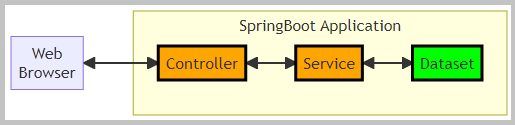
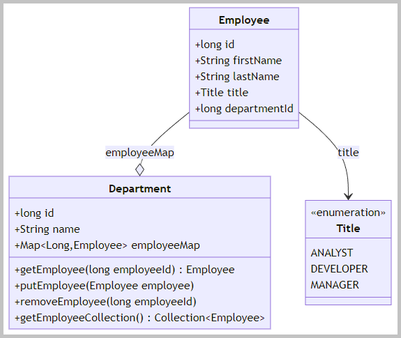
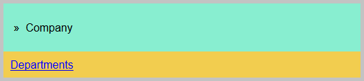
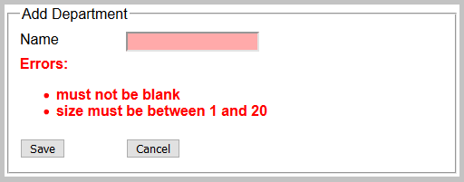
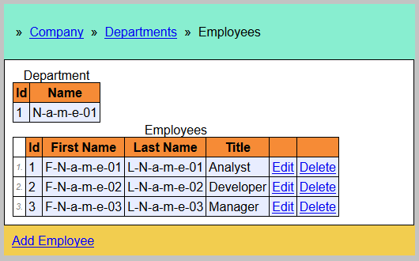
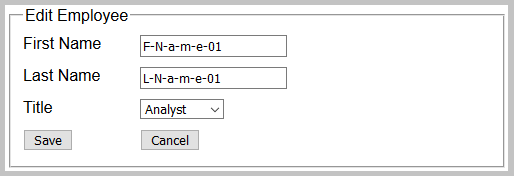
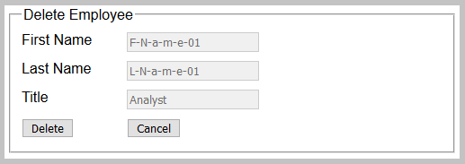
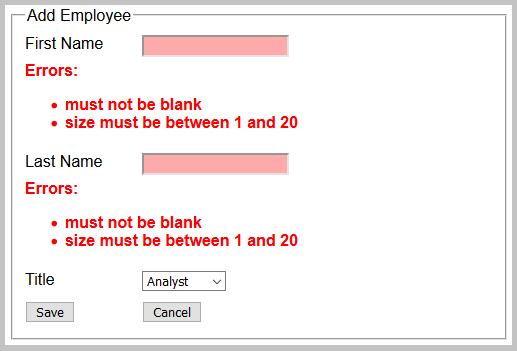

<!DOCTYPE html>
<html lang="en">
<meta charset="UTF-8">
<body>

<h2 id="contents">Study08 README Contents</h2>
<h3 id="top">Research the <a href="https://docs.spring.io/spring-framework/reference/web/webmvc.html">Spring Web MVC</a>
with <a href="https://www.thymeleaf.org/index.html">Thymeleaf</a></h3>

 

<i>The flowchart with Spring Boot application.</i>

The <a href="https://www.thymeleaf.org/index.html">Thymeleaf</a> is a server-side Java template engine. 
The <a href="https://github.com/k1729p/Study08/blob/main/src/main/java/kp/utils/SampleDataset.java">Sample Dataset</a> 
stores the data in the Java object 'Map&lt;Long, Department&gt;'.

The sections of this project:

<ol>
<li><a href="#ONE"><b>Use Cases</b></a></li>
<li><a href="#TWO"><b>Spring Boot Server</b></a></li>
<li><a href="#THREE"><b>Web Browser Client</b></a></li>
</ol>

Java source code. Packages: 
 

    <i>application sources</i>&nbsp;:&nbsp;
	<a href="https://github.com/k1729p/Study08/tree/main/src/main/java/kp">kp</a> 

    <i>test sources</i>&nbsp;:&nbsp;
	<a href="https://github.com/k1729p/Study08/tree/main/src/test/java/kp">kp</a> 

 

<i>The domain objects class diagram.</i>

 

    <a href="http://htmlpreview.github.io/?https://github.com/k1729p/Study08/blob/main/docs/apidocs/index.html">
	Java API Documentation</a>&nbsp;●&nbsp;
    <a href="http://htmlpreview.github.io/?https://github.com/k1729p/Study08/blob/main/docs/testapidocs/index.html">
	Java Test API Documentation</a> 

<h3 id="ONE">❶ Use Cases</H3>

<table style="border:solid">
<tr><td style="border:solid"><b>Company</b></td>
<td style="border:solid">welcome page</td></tr>
<tr><td style="border:solid"><b>Show departments</b></td>
<td style="border:solid">table view of the company's departments and links to its employees</td></tr>
<tr><td style="border:solid"><b>Show employees</b></td>
<td style="border:solid">table view of selected department employees</td></tr>
<tr><td style="border:solid"><b>Edit the existing employee</b></td>
<td style="border:solid">edit the information about an employee</td></tr>
<tr><td style="border:solid"><b>Update the existing employee</b></td>
<td style="border:solid">update the information about an employee</td></tr>
<tr><td style="border:solid"><b>Delete the employee</b></td>
<td style="border:solid">delete an employee from the department</td></tr>
<tr><td style="border:solid"><b>Add a new employee</b></td>
<td style="border:solid">add a new employee to the department</td></tr>
<tr><td style="border:solid"><b>Edit the existing department</b></td>
<td style="border:solid">edit the information about a department</td></tr>
<tr><td style="border:solid"><b>Update the existing department</b></td>
<td style="border:solid">update the information about a department</td></tr>
<tr><td style="border:solid"><b>Delete the department</b></td>
<td style="border:solid">delete the existing department (with its employees) from the company</td></tr>
<tr><td style="border:solid"><b>Add a new department</b></td>
<td style="border:solid">add a new department to the company</td></tr>
</table>

 

<i>The use case diagram.</i>

<a href="#top">Back to the top of the page</a>

<h3 id="TWO">❷ Spring Boot Server</H3>

Action: 
 
 1. With batch file 
<a href="https://github.com/k1729p/Study08/blob/main/0_batch/01%20MVN%20clean%20install%20run.bat"> 
<i>"01 MVN clean install run.bat"</i></a> build and start the Spring Boot Server. 

 
2.1. Application tests

<ul>
<li>The <a href="https://github.com/k1729p/Study08/tree/main/src/test/java/kp/company/client/side">client-side tests</a>.
  <ul>
  <li>Tests use <b>TestRestTemplate</b>.</li>
  <li>Test classes are annotated with <i>@SpringBootTest</i> annotation.</li>
  <li>Spring Boot server is STARTED.</li>
  </ul>
</li>
<li>The <a href="https://github.com/k1729p/Study08/tree/main/src/test/java/kp/company/mvc">tests with server-side support</a>.
  <ul>
  <li>Tests use Spring MVC Test Framework, also known as <b>MockMvc</b>.</li>
  <li>Test classes are annotated with <i>@WebMvcTest</i> annotation.</li>
  <li>This test framework does not use a running Servlet container.</li>
  <li>Spring Boot server is NOT STARTED.</li>
  </ul>
</li>
</ul>

<a href="#top">Back to the top of the page</a>

<h3 id="THREE">❸ Web Browser Client</H3>

Action: 
 
 1. With the URL <a href="http://localhost:8080">http://localhost:8080</a> 
open the home page in the web browser and execute CRUD actions. 
 2. With batch file <a href="https://github.com/k1729p/Study08/blob/main/0_batch/02%20LYNX%20call%20server.bat"> 
<i>"02 LYNX call server.bat"</i></a> send requests to the web application from the Lynx browser. 

 
3.1. Menu "<a href="http://localhost:8080/company">Company</a>". Template file 
<a href="https://github.com/k1729p/Study08/blob/main/src/main/resources/templates/company/home.html">home.html</a>. 
The handler GET method:
<a href="https://github.com/k1729p/Study08/blob/main/src/main/java/kp/company/controller/CompanyController.java#L23">
kp.company.controller.CompanyController::company</a>.

 
<i>Welcome page of the application. Overview of the company.</i>

 
3.2. Menu "<a href="http://localhost:8080/listDepartments">Departments</a>". Template files 
<a href="https://github.com/k1729p/Study08/blob/main/src/main/resources/templates/departments/list.html">list.html</a>, 
<a href="https://github.com/k1729p/Study08/blob/main/src/main/resources/templates/departments/edit.html">edit.html</a>, 
<a href="https://github.com/k1729p/Study08/blob/main/src/main/resources/templates/departments/confirmDelete.html">confirmDelete.html</a>.

3.2.1. Listing all departments. 
The handler GET method: 
<a href="https://github.com/k1729p/Study08/blob/main/src/main/java/kp/company/controller/DepartmentController.java#L49">
kp.company.controller.DepartmentController::listDepartments</a>.

 

<i>Listing all departments.</i>

3.2.2. Editing the existing department. 
Showing the dialog. The handler GET method: 
<a href="https://github.com/k1729p/Study08/blob/main/src/main/java/kp/company/controller/DepartmentController.java#L79">
kp.company.controller.DepartmentController::startDepartmentEditing</a>. 
The 'Save' button. The handler POST method: 
<a href="https://github.com/k1729p/Study08/blob/main/src/main/java/kp/company/controller/DepartmentController.java#L100">
kp.company.controller.DepartmentController::saveDepartment</a>. 
The 'Cancel' button. The handler POST method: 
<a href="https://github.com/k1729p/Study08/blob/main/src/main/java/kp/company/controller/DepartmentController.java#L120">
kp.company.controller.DepartmentController::cancelDepartmentEditing</a>.

 

<i>Editing the existing department.</i>

3.2.3. Deleting the existing department. 
Showing the dialog. The handler GET method: 
<a href="https://github.com/k1729p/Study08/blob/main/src/main/java/kp/company/controller/DepartmentController.java#L134">
kp.company.controller.DepartmentController::startDepartmentDeleting</a>. 
The 'Delete' button. The handler POST method: 
<a href="https://github.com/k1729p/Study08/blob/main/src/main/java/kp/company/controller/DepartmentController.java#L154">
kp.company.controller.DepartmentController::deleteDepartment</a>. 
The 'Cancel' button. The handler POST method: 
<a href="https://github.com/k1729p/Study08/blob/main/src/main/java/kp/company/controller/DepartmentController.java#L172">
kp.company.controller.DepartmentController::cancelDepartmentDeleting</a>.

 

<i>Deleting the existing department.</i>

3.2.4. Adding a new department. 
Showing the dialog. The handler GET method: 
<a href="https://github.com/k1729p/Study08/blob/main/src/main/java/kp/company/controller/DepartmentController.java#L63">
kp.company.controller.DepartmentController::startDepartmentAdding</a>. 
The 'Save' button. The handler POST method: 
<a href="https://github.com/k1729p/Study08/blob/main/src/main/java/kp/company/controller/DepartmentController.java#L100">
kp.company.controller.DepartmentController::saveDepartment</a>. 
The 'Cancel' button. The handler POST method: 
<a href="https://github.com/k1729p/Study08/blob/main/src/main/java/kp/company/controller/DepartmentController.java#L120">
kp.company.controller.DepartmentController::cancelDepartmentEditing</a>.

 

<i>Adding a new department. Displayed validation messages.</i>

 
3.3. Menu "<a href="http://localhost:8080/listEmployees?departmentId=1">Employees</a>". Template files 
<a href="https://github.com/k1729p/Study08/blob/main/src/main/resources/templates/employees/list.html">list.html</a>, 
<a href="https://github.com/k1729p/Study08/blob/main/src/main/resources/templates/employees/edit.html">edit.html</a>, 
<a href="https://github.com/k1729p/Study08/blob/main/src/main/resources/templates/employees/confirmDelete.html">confirmDelete.html</a>.

3.3.1. Listing all employees. 
The handler GET method: 
<a href="https://github.com/k1729p/Study08/blob/main/src/main/java/kp/company/controller/EmployeeController.java#L64">
kp.company.controller.EmployeeController::listEmployees</a>.

 

<i>Listing all employees of the selected department.</i>

3.3.2. Editing the existing employee. 
Showing the dialog. The handler GET method: 
<a href="https://github.com/k1729p/Study08/blob/main/src/main/java/kp/company/controller/EmployeeController.java#L107">
kp.company.controller.EmployeeController::startEmployeeEditing</a>. 
The 'Save' button. The handler POST method: 
<a href="https://github.com/k1729p/Study08/blob/main/src/main/java/kp/company/controller/EmployeeController.java#L128">
kp.company.controller.EmployeeController::saveEmployee</a>. 
The 'Cancel' button. The handler POST method: 
<a href="https://github.com/k1729p/Study08/blob/main/src/main/java/kp/company/controller/EmployeeController.java#L154">
kp.company.controller.EmployeeController::cancelEmployeeEditing</a>.

 

<i>Editing the existing employee.</i>

3.3.3. Deleting the existing employee. 
Showing the dialog. The handler GET method: 
<a href="https://github.com/k1729p/Study08/blob/main/src/main/java/kp/company/controller/EmployeeController.java#L169">
kp.company.controller.EmployeeController::startEmployeeDeleting</a>. 
The 'Delete' button. The handler POST method: 
<a href="https://github.com/k1729p/Study08/blob/main/src/main/java/kp/company/controller/EmployeeController.java#L190">
kp.company.controller.EmployeeController::deleteEmployee</a>. 
The 'Cancel' button. The handler POST method: 
<a href="https://github.com/k1729p/Study08/blob/main/src/main/java/kp/company/controller/EmployeeController.java#L209">
kp.company.controller.EmployeeController::cancelEmployeeDeleting</a>.

 

<i>Deleting the existing employee.</i>

3.3.4. Adding a new employee. 
Showing the dialog. The handler GET method: 
<a href="https://github.com/k1729p/Study08/blob/main/src/main/java/kp/company/controller/EmployeeController.java#L85">
kp.company.controller.EmployeeController::startEmployeeAdding</a>. 
The 'Save' button. The handler POST method: 
<a href="https://github.com/k1729p/Study08/blob/main/src/main/java/kp/company/controller/EmployeeController.java#L128">
kp.company.controller.EmployeeController::saveEmployee</a>. 
The 'Cancel' button. The handler POST method: 
<a href="https://github.com/k1729p/Study08/blob/main/src/main/java/kp/company/controller/EmployeeController.java#L154">
kp.company.controller.EmployeeController::cancelEmployeeEditing</a>.

 

<i>Adding a new employee. Displayed validation messages.</i>

<a href="#top">Back to the top of the page</a>
</body>
</html>