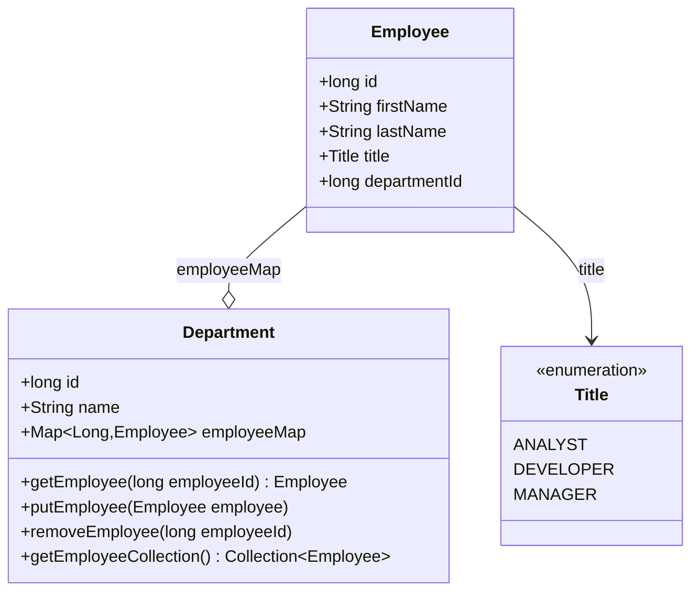

```mermaid
classDiagram
direction TD
class Department {
 +long id
 +String name
 +Map~Long,Employee~ employeeMap
 +getEmployee(long employeeId) Employee
 +putEmployee(Employee employee)
 +removeEmployee(long employeeId)
 +getEmployeeCollection() Collection~Employee~
}
class Employee {
 +long id
 +String firstName
 +String lastName
 +Title title
 +long departmentId
}
class Title {
 <<enumeration>>
 ANALYST
 DEVELOPER
 MANAGER
}

Employee --o Department  : employeeMap
Employee --> Title : title
```